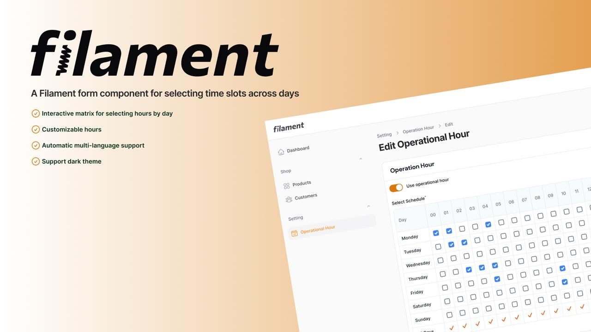

# Filament Time Matrix

An interactive Filament form component for selecting time slots across days with powerful validation and manipulation features.

## Features

- 📅 Interactive day/hour matrix with bulk selection
- ✅ Select all hours/days/slots at once
- 🔄 Reset functionality
- 🔢 Real-time slot counter
- 🛠️ Facade for validation & manipulation
- 🌍 Multi-language support via Carbon
- 🎨 Dark mode support


## Requirements

- **PHP**: 8.1 or higher
- **Filament**: 3.0 or higher
- **Laravel**: 10.0 or 11.0 or higher
- **Carbon**: 2.0 or 3.0 or higher

---

## Installation

```bash
composer require konnco/filament-timematrix
```

## Quick Start

### Simple Usage
```php
use Konnco\FilamentTimeMatrix\Forms\TimeMatrix;

TimeMatrix::make('schedule')
    ->label('Select Schedule')
    ->required();
```

This will create a time matrix with:
- All 7 days of the week (Monday - Sunday)
- All 24 hours (0-23)
- Select all hours/days buttons enabled
- Using your app's default locale

### Complete Usage
```php
use Konnco\FilamentTimeMatrix\Forms\TimeMatrix;
use Konnco\FilamentTimeMatrix\Enums\Day;
use Carbon\CarbonInterface;

TimeMatrix::make('schedule')
    ->label('Select Schedule')
    ->required()
    ->helperText('Select operational hours for each day')
    
    # Set custom hour range (9 AM - 5 PM)
    ->hours(startTime: 9, endTime: 17)

    # OR use business hours shortcut with default range from 9 AM - 5 PM
    ->businessHours()
    
    # Set specific days using Day enum
    ->days([
        Day::MONDAY,
        Day::TUESDAY,
        Day::WEDNESDAY,
    ])
    # OR use Carbon constants
    ->days([
        CarbonInterface::MONDAY,
        CarbonInterface::SATURDAY,
    ])
    # OR use helper methods
    ->weekdays() # Monday - Friday only
    ->weekend()  # Saturday - Sunday only
    
    # Set locale and format
    ->locale('id', 'long')  # long: Monday, short: Mon,
    ->locale('en', 'short')
    
    # Toggle select all buttons
    ->showSelectAllHours(false)
    ->showSelectAllDays(false)
    
    ->columnSpanFull();
```

### Available Methods

| Method | Description | Example |
|--------|-------------|---------|
| `hours(int $startTime, int $endTime)` | Set custom hour range (0-23) | `->hours(8, 18)` |
| `businessHours(int $startTime, int $endTime)` | Shortcut for business hours | `->businessHours(9, 17)` |
| `days(array $days)` | Set specific days (Day enum or Carbon constants) | `->days([Day::MONDAY, Day::FRIDAY])` |
| `weekdays()` | Monday to Friday only | `->weekdays()` |
| `weekend()` | Saturday and Sunday only | `->weekend()` |
| `locale(?string $locale, string $format)` | Set locale and format (long/short/min) | `->locale('id', 'short')` |
| `showSelectAllHours(bool $show)` | Show/hide select all hours button | `->showSelectAllHours(false)` |
| `showSelectAllDays(bool $show)` | Show/hide select all days button | `->showSelectAllDays(false)` |


---

## Facade Methods Reference

#### `isActiveAt(array $data, ?Carbon $dateTime = null): bool`

Check if time slot is active at a specific time or now (default).

**Parameters:**
- `$data` (array): The time matrix data
- `$dateTime` (Carbon|null, optional): DateTime to check. **Defaults to now()**

**Returns:** `bool`

**Examples:**
```php
use Konnco\FilamentTimeMatrix\Facades\TimeMatrix;
use Carbon\Carbon;

$data = ['monday' => [8 => true, 9 => true]];

# Check if active right now
TimeMatrix::isActiveAt($data);

# Check if active at specific time
TimeMatrix::isActiveAt($data, Carbon::parse('next monday 8:00')); # true
TimeMatrix::isActiveAt($data, Carbon::tomorrow()->setTime(14, 0)); # true/false

# Check if active 2 hours from now
TimeMatrix::isActiveAt($data, now()->addHours(2));
```

---

#### `hasActiveDay(array $data, string|Day|null $day = null): bool`

Check if there are active slots on a specific day or today (default).

**Parameters:**
- `$data` (array): The time matrix data
- `$day` (string|Day|null, optional): Day to check. **Defaults to today**

**Returns:** `bool`

**Examples:**
```php
use Konnco\FilamentTimeMatrix\Enums\Day;
use Carbon\Carbon;

$data = [
    'monday' => [8 => true],
    'tuesday' => [14 => true],
];

# Check if active today (no parameter needed!)
TimeMatrix::hasActiveDay($data); # true/false

# Check specific days
TimeMatrix::hasActiveDay($data, Day::MONDAY);
TimeMatrix::hasActiveDay($data, 'tuesday'); 
TimeMatrix::hasActiveDay($data, Day::WEDNESDAY); 

# Check tomorrow
TimeMatrix::hasActiveDay($data, Day::fromCarbon(Carbon::tomorrow()));
```

---

#### `getActiveHours(array $data, string|Day|null $day = null): array`

Get active hours for a specific day or today (default).

**Parameters:**
- `$data` (array): The time matrix data  
- `$day` (string|Day|null, optional): Day to get hours from. **Defaults to today**

**Returns:** `array` - Array of hours like [8, 9, 10, 14, 15]

**Examples:**
```php
use Konnco\FilamentTimeMatrix\Enums\Day;

$data = [
    'monday' => [8 => true, 9 => true, 14 => true],
    'tuesday' => [10 => true, 11 => true],
];

# Get today's active hours
TimeMatrix::getActiveHours($data); # [8, 9, 14] 

# Get specific day's hours
TimeMatrix::getActiveHours($data, Day::MONDAY); # [8, 9, 14]
TimeMatrix::getActiveHours($data, 'tuesday'); # [10, 11]

# Get tomorrow's hours
TimeMatrix::getActiveHours($data, Day::fromCarbon(Carbon::tomorrow()));

# Loop through today's hours
foreach (TimeMatrix::getActiveHours($data) as $hour) {
    echo sprintf('%02d:00 - Available', $hour);
}
```

---

### Validation Methods

#### `validate(array $data): bool`

Validate the structure of time matrix data.

**Example:**
```php
$valid = ['monday' => [8 => true, 9 => false]];
TimeMatrix::validate($valid); # true

$invalid = ['monday' => 'not an array'];
TimeMatrix::validate($invalid); # false
```

---

#### `hasSelection(array $data): bool`

Check if there is at least one selected slot.

**Example:**
```php
$data = ['monday' => [8 => true, 9 => false]];
TimeMatrix::hasSelection($data); # true

$empty = ['monday' => [8 => false]];
TimeMatrix::hasSelection($empty); # false
```

---

### Statistics Methods

#### `isFullyActive(array $data): bool`

Check if schedule is 24/7 (all days, all hours).

**Example:**
```php
TimeMatrix::isFullyActive($data); # true/false
```

---

#### `getTotalActiveHours(array $data): int`

Get total active hours per week.

**Example:**
```php
$total = TimeMatrix::getTotalActiveHours($data); # e.g., 40
```

---

#### `getActivePercentage(array $data): float`

Get percentage of active hours (0-100).

**Example:**
```php
$percentage = TimeMatrix::getActivePercentage($data); # e.g., 23.81
```

---

#### `getActiveDays(array $data): array`

Get days that have at least one active hour.

**Returns:** Array of `Day` enums

**Example:**
```php
$days = TimeMatrix::getActiveDays($data);
# [Day::MONDAY, Day::TUESDAY, Day::FRIDAY]

foreach ($days as $day) {
    echo $day->label(); # Monday, Tuesday, Friday
}
```

---

#### `isDayHourActive(array $data, string|Day $day, int $hour): bool`

Check if a specific day and hour combination is active.

**Example:**
```php
TimeMatrix::isDayHourActive($data, day: Day::MONDAY, hour: 9); # true/false
TimeMatrix::isDayHourActive($data, day: 'friday', hour: 18); # true/false
```

---

### Time Query Methods

#### `getNextAvailableSlot(array $data, Carbon $from): ?Carbon`

Get next available slot from a specific time.

**Example:**
```php
$next = TimeMatrix::getNextAvailableSlot($data, now());
if ($next) {
    echo $next->format('l, H:i'); # "Monday, 08:00"
}
```

---

#### `getSlotsInRange(array $data, Carbon $start, Carbon $end): array`

Get all slots within a date range.

**Example:**
```php
$slots = TimeMatrix::getSlotsInRange(
    $data,
    now()->startOfWeek(),
    now()->endOfWeek()
);

foreach ($slots as $slot) {
    echo $slot->format('D H:i') . "\n";
}
```

---

#### `toCarbonSlots(array $data, ?Carbon $referenceWeek = null): array`

Convert to Carbon instances for a specific week.

**Example:**
```php
# Current week
$slots = TimeMatrix::toCarbonSlots($data);

# Next week
$nextWeek = now()->addWeek();
$slots = TimeMatrix::toCarbonSlots($data, $nextWeek);
```

---

### Formatting Methods

#### `toReadableFormat(array $data): array`

Convert to simplified format.

**Returns:** `['monday' => [8, 9, 10], 'tuesday' => [14, 15]]`

**Example:**
```php
$readable = TimeMatrix::toReadableFormat($data);
```

---

#### `formatDaySchedule(array $data, string|Day $day): string`

Format single day to human-readable string.

**Returns:** String like "08:00-10:59, 14:00-16:59"

**Example:**
```php
$schedule = TimeMatrix::formatDaySchedule($data, Day::MONDAY);
# "08:00-10:59, 14:00-16:59"
```

---

#### `formatAllDays(array $data, ?string $locale = null): array`

Format all days with localized labels.

**Example:**
```php
$formatted = TimeMatrix::formatAllDays($data, 'en');
# [
#     'Monday' => '08:00-10:59, 14:00-16:59',
#     'Tuesday' => '14:00-15:59'
# ]

$formatted = TimeMatrix::formatAllDays($data, 'id');
# [
#     'Senin' => '08:00-10:59, 14:00-16:59',
#     'Selasa' => '14:00-15:59'
# ]
```

---

## Real-World Usage Examples

### 1. Check Merchant Status

```php
use Konnco\FilamentTimeMatrix\Facades\TimeMatrix;

class StoreService
{
    public function getOpenStores()
    {
        return Store::all()->filter(function ($store$) {
            # No parameter = check now!
            return TimeMatrix::isActiveAt($store$->operational_hours);
        });
    }
    
    public function countOpenNow(): int
    {
        return Store::get()->filter(fn($store) => 
            TimeMatrix::isActiveAt($store->operational_hours)
        )->count();
    }
    
    public function getOpenTomorrow()
    {
        return Store::get()->filter(fn($store) =>
            TimeMatrix::hasActiveDay(
                $store->operational_hours,
                Day::fromCarbon(Carbon::tomorrow())
            )
        );
    }
}
```

---

### 2. Display in Infolist

```php
use Filament\Infolists\Components\TextEntry;

TextEntry::make('schedule')
    ->label('Status Now')
    ->state(fn($record) => TimeMatrix::isActiveAt($record->schedule) 
        ? '✓ Open' 
        : '✗ Closed'
    )
    ->badge()
    ->color(fn($record) => TimeMatrix::isActiveAt($record->schedule) 
        ? 'success' 
        : 'danger'
    ),

TextEntry::make('schedule')
    ->label('Today\'s Hours')
    ->state(function ($record) {
        $hours = TimeMatrix::getActiveHours($record->schedule); # Today by default!
        return empty($hours) 
            ? 'Closed today'
            : implode(', ', array_map(fn($h) => sprintf('%02d:00', $h), $hours));
    }),
```
---

## API Methods Summary

### Smart Default Methods (NEW!)
| Method | Default Behavior | Usage |
|--------|-----------------|-------|
| `isActiveAt($data, ?$dateTime)` | Checks **now** if no param | `isActiveAt($data)` |
| `hasActiveDay($data, ?$day)` | Checks **today** if no param | `hasActiveDay($data)` |
| `getActiveHours($data, ?$day)` | Gets **today's** hours if no param | `getActiveHours($data)` |

### All Available Methods

| Method | Return Type | Description |
|--------|-------------|-------------|
| `validate($data)` | `bool` | Validate structure |
| `hasSelection($data)` | `bool` | Check if has selections |
| `isActiveAt($data, ?$dateTime)` | `bool` | Check active at time (default: now) |
| `hasActiveDay($data, ?$day)` | `bool` | Check day has active slots (default: today) |
| `getActiveHours($data, ?$day)` | `array` | Get active hours (default: today) |
| `isFullyActive($data)` | `bool` | Check if 24/7 |
| `getTotalActiveHours($data)` | `int` | Total hours per week |
| `getActivePercentage($data)` | `float` | Coverage percentage |
| `getActiveDays($data)` | `array<Day>` | Days with active slots |
| `isDayHourActive($data, $day, $hour)` | `bool` | Check specific day+hour |
| `getNextAvailableSlot($data, $from)` | `?Carbon` | Next available slot |
| `getSlotsInRange($data, $start, $end)` | `array<Carbon>` | Slots in range |
| `toCarbonSlots($data, ?$week)` | `array<Carbon>` | Convert to Carbon |
| `formatDaySchedule($data, $day)` | `string` | Format single day |
| `formatAllDays($data, ?$locale)` | `array` | Format all days |
| `toReadableFormat($data)` | `array` | Simplified format |

---

## License

MIT License. See [LICENSE](LICENSE) for details.

## Credits

- [Konnco Studio](https://github.com/konnco)
- [All Contributors](../../contributors)

## Support

For issues and feature requests, please use the [GitHub issue tracker](https://github.com/konnco/filament-timematrix/issues).
